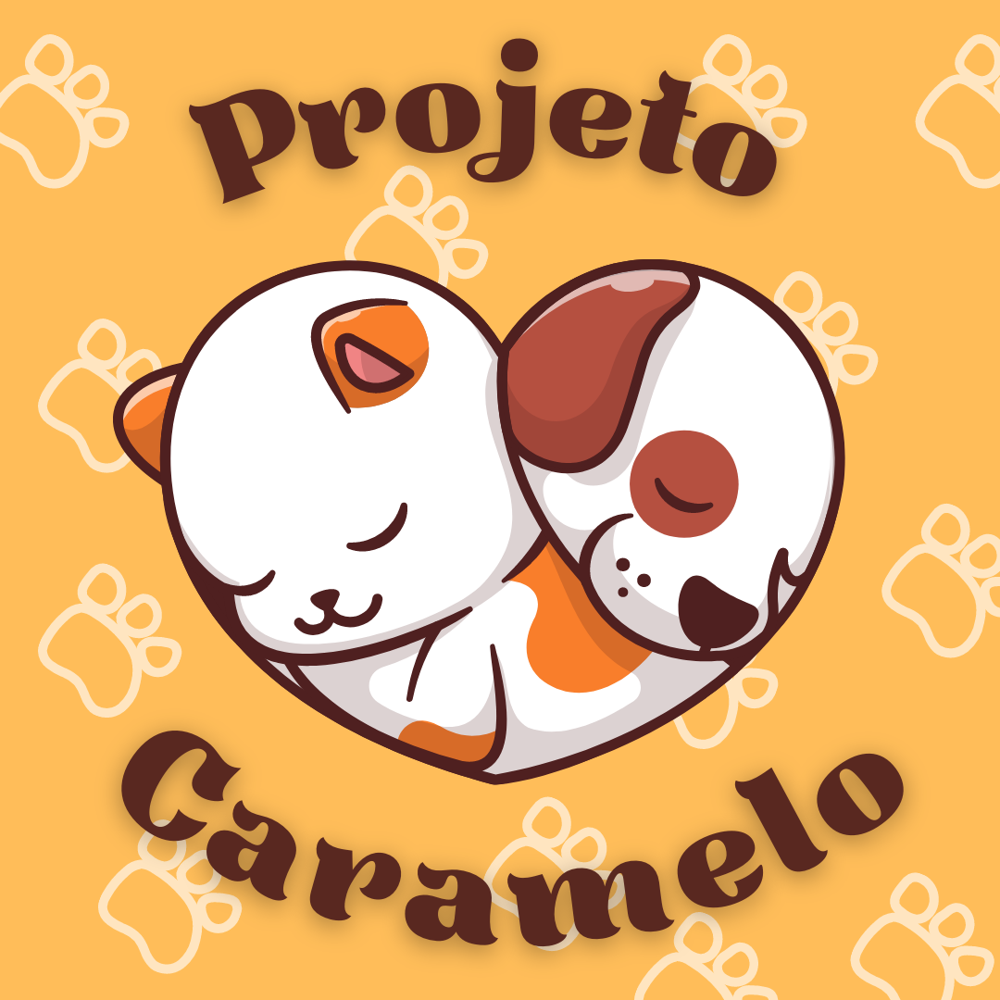

<p align="center">
  <a>
    <a href="https://projeto-caramelo.herokuapp.com/">
    <a href="https://www.mongodb.com/cloud/atlas">
    <a href="https://nodejs.org/pt-br/">
  </a>
</p>

<h1 align="center">
  
<p align="center">🐕 🍬 Projeto Caramelo 🍬 🐕<p>
</h1>

> Projeto final do bootcamp {reprograma} backend, criando CRUD de ONG's e abrigos de animais.

### 📑 Índice
---

- [Problemática](#problemática-)
- [Solução](#solução-)
- [Público alvo](#o-público-alvo)
- [Arquitetura](#-arquitetura)
- [Tecnologias](#-tecnologias)
- [Orientações](#-orientações)
   - [Pré-requisitos](#-pré-requisitos)
   - [Rodando o Back End (servidor)](#-rodando-o-back-end-servidor)
   - [Rotas, links e métodos](#--rotas-links-e-métodos)
      - [Places](#places)
      - [Usuários](#usuários)
- [Tratamento de erro](#-orientações)
- [Implementações futuras](#implementações-futuras)


### Problemática 😿
Grande número de animais abandonados na região metropolitana do Recife.

### Solução 🐶
Voltado para animais - gatos e cachororos - em situação de vunerabilidade na região metropolitana do Recife procurando uma lar temporário ou uma adoção responsável.
Terá uma base de dados de hosts que pode ser abrigos, ONGs ou pessoas que se disponibilizam para abrigar os animais até sua possivel adoção.

#### O público alvo: 
1) pessoas que encontram algum animal abandonado e gostariam entregar à uma local de acolhimento. 🏡
2) pessoas que buscam por locais que tenham pets disponiveis para adoção. 🐈

### 🧱 Arquitetura
---
```
├───📂src/
│   ├───📂controllers/
│   │   ├───placesController.js
│   │   └───userController.js
│   ├───📂database/
│   │   └───configMongo.js
│   ├───📂helpers/
│   │   └───auth.js
│   ├───📂middlewares/
│   │   └───auth.js
│   ├───📂models/
│   │   ├───placesSchema.js
│   │   └───userSchema.js
│   ├───📂routes/
│   │   ├───placesRouter.js
│   │   └───userRouter.js
│   ├───app.js 
│   └───index.js
├───.env
├───.env.example
├───.gitignore
├───package-lock.json
├───package.json
├───Procfile
├───README.md
└───server.js
```
### 💻 Tecnologias
---
As seguintes ferramentas foram usadas na construção do projeto:

- [JavaScript](https://www.javascript.com/)
- [Node.js](https://nodejs.org/en/)
- [Express](https://expressjs.com/pt-br/)
- [Nodemon](https://nodemon.io/)
- [Cors](https://www.typescriptlang.org/)
- [Bcrypt](https://www.npmjs.com/package/bcrypt)
- [JWT](https://www.npmjs.com/package/jsonwebtoken)
- [Mongoose](https://www.npmjs.com/package/mongoose)
- [Dotenv-safe](https://www.npmjs.com/package/dotenv-safe)

### 📌 Orientações
---
### 📎 Pré-requisitos:

Antes de começar, você vai precisar ter instalado em sua máquina as seguintes ferramentas:
* [Git](https://git-scm.com);
* [Node.js](https://nodejs.org/en/);
* Para o banco de dados usaremos um não relacional - NoSQL - MongoDB, se você quiser criar seu db na nuvem, deve criar uma conta no [Mongo Atlas](https://account.mongodb.com/), a partir disso é possivel da nuvem mesmo gerencia-lo ou também é possivel atráves do aplicativo desktop [MongoCompass](https://www.mongodb.com/products/compass).
* Além disto é bom ter um editor para trabalhar com o código como [VSCode](https://code.visualstudio.com/).

#### 🎲 Rodando o Back End (servidor)

```bash
# Clone este repositório
$ git clone <https://github.com/victoriardspaiva/projetoLivre-Caramelo>

# Acesse a pasta do projeto no terminal/cmd
$ cd projetoLivre-Caramelo

# Instale as dependências
$ npm install ou npm i

# Execute o servidor
$ npm start

# O servidor inciará na porta:9090 - acesse <http://localhost:9090> 
```
### 🚀  Rotas, links e métodos
---
A ferramenta de suporte de criação das requisição usada foi o [Postman](https://www.postman.com/), você pode usar a de sua preferência.


#### Variáveis de ambientes: 
é possivel criar variáveis que sejam visiveis para todo o escopo do projeto, existem alguns beneficios um dele é não deixar o valor exposto, além de poder ser reutilizado sempre que necessário.

Para criar a variavel é necessário na collection > aba Variables preencha na coluna variable da tabela o nome da variavel `URL` e em initial value e current value colocar o valor `http://localhost:9090`

> Na barra de URL `endpoint`, vamos preencher o nome da variavel entre dois cochetes `{{URL}}`.

## Places:

> Voce pode acessar a rota: localmente, sem ou com variavel de ambiente, ou pode acessar também -só as rotas get- consumindo pela aplicação.
> Obs.: {{URL}}/home/all ou https://projeto-caramelo.herokuapp.com/home/all.


- Página inicial:<br />
GET 🏚️ <http://localhost:9090/>

- Listar todas os hosts disponiveis:<br />
GET 🗂️ <http://localhost:9090/home/all>

- Listar hosts por filtros:<br />
GET 🗃️ <http://localhost:9090/home/search>

   - ✔️ name
   - ✔️ id
   - ✔️ animal
   - ✔️ district
   - ✔️ host

### Rotas privadas:

> Para ter acesso as rotas privadas é necessário primeiramente criar registro de usuário, depois realizar o login, copiar o token de autenticação. Ir na aba de Authorization no Type escolher `Bearer Token` e no campo token colar o código que foi copiado.

- Criar um cadastro para o host:<br /> 
POST 📋 <http://localhost:9090/home/create>

- Atualizar dados cadastrais do host:<br />
PUT 📝 <http://localhost:9090/home/update><br />

- Deletar um host:<br />
DELETE 🗑️ <http://localhost:9090/home/delete><br />

## Usuários 

- Listar todos usuários:<br />
GET 🗂️ <http://localhost:9090/user/all>

- Listar usuário por id:<br />
GET 📂 <http://localhost:9090/user/id?>

- Registrar usuários:<br /> 
POST 📋 <http://localhost:9090/user/register>

- Login de usuário:<br /> 
POST ✅ <http://localhost:9090/user/login>

- Atualizar dados cadastrais do usuário:<br />
PUT 📝 <http://localhost:9090/user/update><br />

- Deletar um usuários:<br />
DELETE ❌ <http://localhost:9090/user/delete><br />

### Tratamento de erro
- [ ] 422 Pesquisa não encontrada (dos filtros)
- [x] só para gatos e cachorros
- [ ] campo vazio
- [ ] letra mauiscula/minuscula 

### Implementações futuras
* Exibir número disponivel de vagas;
* Perfil de usuário:
   * Quero adotar
   * Quero resgatar
   * Quero ser cuidador 
* Cadastro de animais disponiveis;
* Notificação de eventos e campanhas de adoção;
* Veterinários parceiros.


